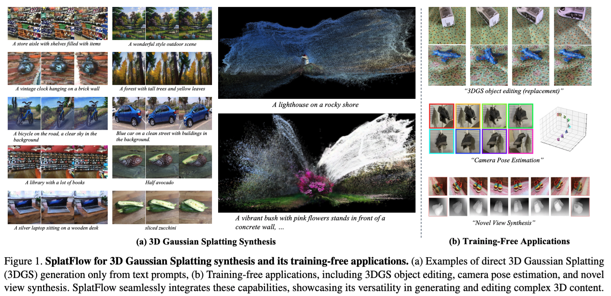

# [CVPR 2025] SplatFlow: Multi-View Rectified Flow Model for 3D Gaussian Splatting Synthesis


<a href="https://arxiv.org/abs/2411.16443"></a>
<a href="https://gohyojun15.github.io/SplatFlow/"></a>
<!-- <a href="https://huggingface.co/spaces/byeongjun-park/HarmonyView"></a> -->

This repository contains the official pytorch implementation of the paper: "SplatFlow: Multi-View Rectified Flow Model for 3D Gaussian Splatting Synthesis". 



## Installation
Our code is tested with Python 3.10, Pytorch 2.4.0, and CUDA 11.8. To install the required packages, run the following command:
```bash
pip3 install torch==2.4.0 torchvision==0.19.0 torchaudio==2.4.0 --index-url https://download.pytorch.org/whl/cu118
pip install -r requirements.txt
```

## Model Checkpoints
We have extended the model training period after submission to enhance its performance. Updated model checkpoints are now available, and benchmark results will be revised following the review process. You can download the model checkpoints from the links below:

| Model               | Link |
| ------------------- | ---- |
| Multi-view RF model |      |
| GSDecoder           |      |

## Inference
### 1. 3DGS Generation

```bash
export PYTHONPATH=$(pwd)
python inference/generate.py +experiments=generation inference.generate.prompt="Your prompt here"
```


## Citation
If you find this repository helpful for your project, please consider citing our work. :)
```
@article{go2024splatflow,
  title={SplatFlow: Multi-View Rectified Flow Model for 3D Gaussian Splatting Synthesis},
  author={Go, Hyojun and Park, Byeongjun and Jang, Jiho and Kim, Jin-Young and Kwon, Soonwoo and Kim, Changick},
  journal={arXiv preprint arXiv:2411.16443},
  year={2024}
}
```

## Acknolwedgement
We thank [director3d](https://github.com/imlixinyang/Director3D)


## TODO:
- [ ] Update project page.
- [ ] Add model checkpoints (maybe google drive)
  - [ ] Review huggingface compatibility 
- [ ] Code verification.
- [ ] Add more details on the README.md
- [ ] Add the training script
